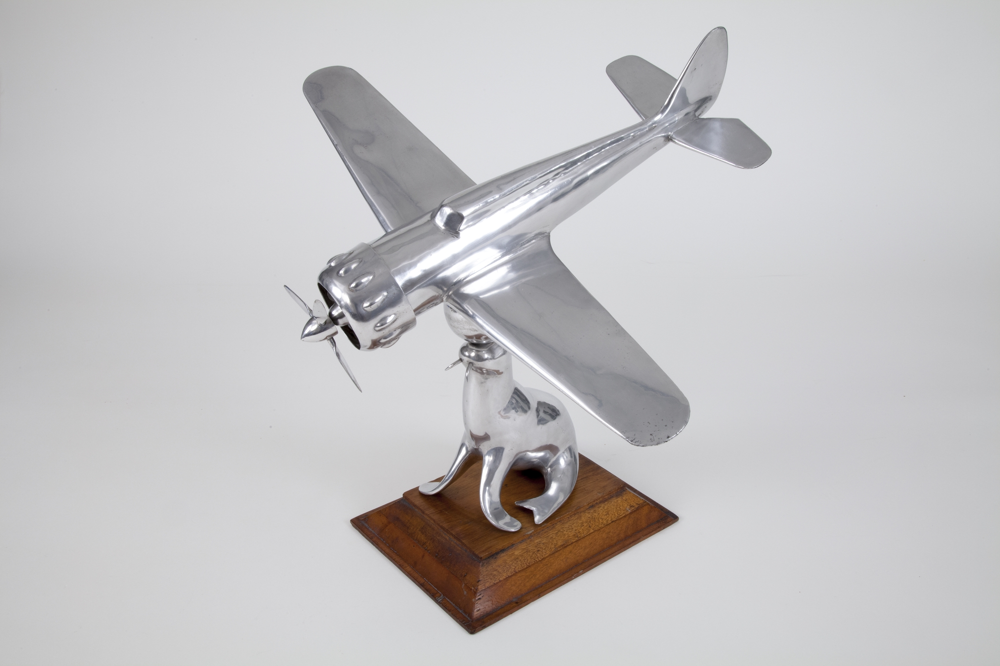
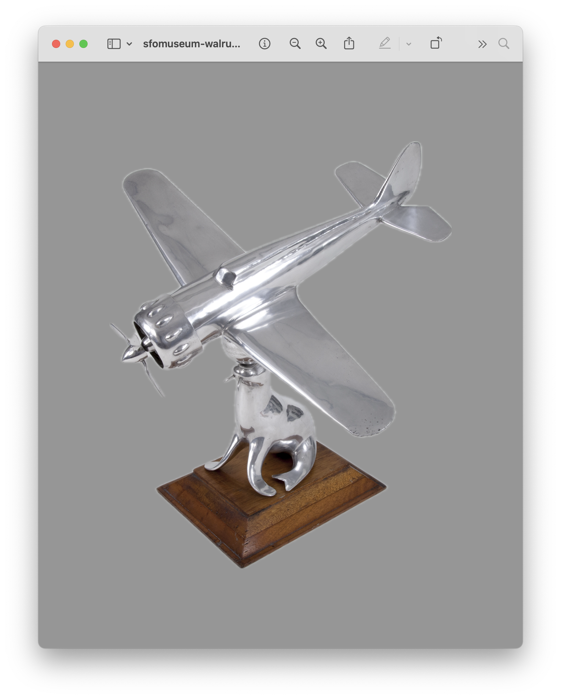
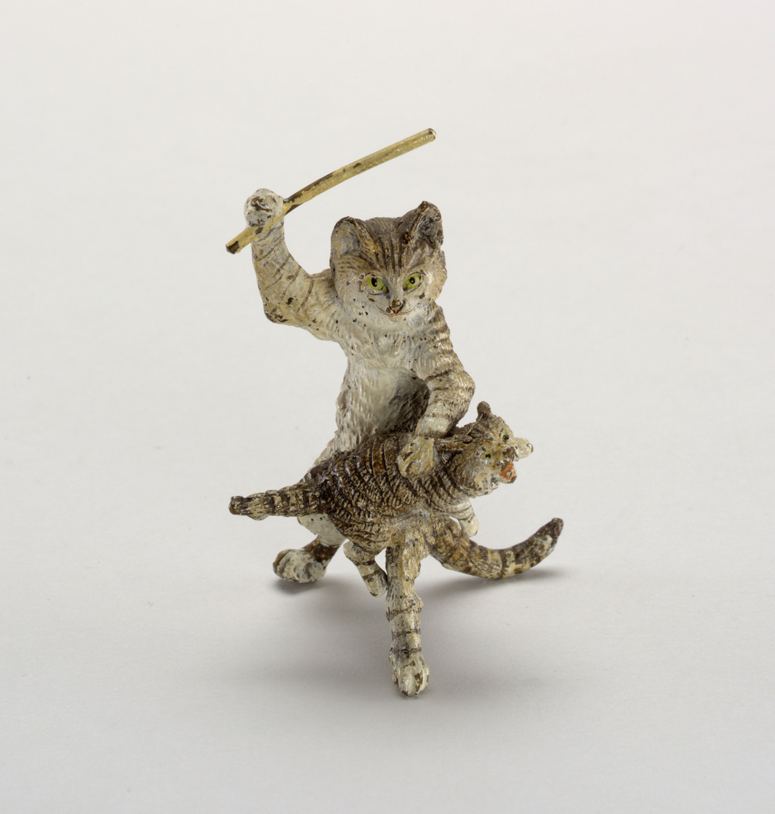
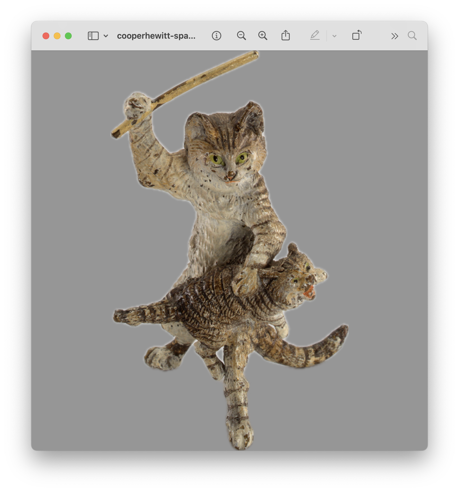
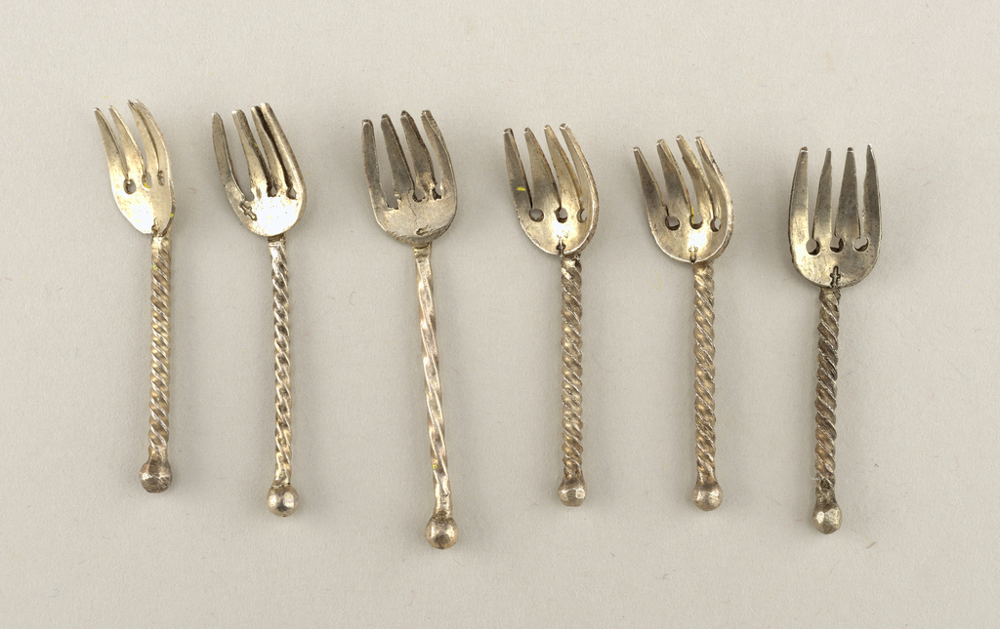
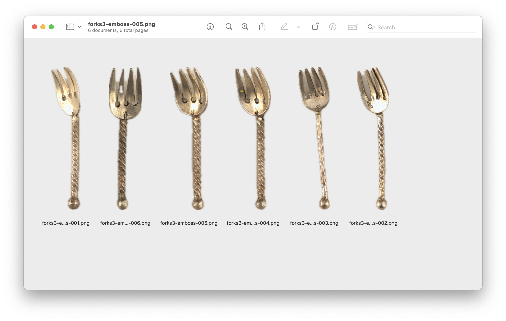

# swift-image-emboss-cli

Command line tool for extracting "subjects" from images using Apple's Vision framework.

## Important

This tool requires Mac OS 14.0 or higher.

## Documentation

Documentation is incomplete.

## Tools

```
$> swift build
```

### image-emboss

```
$> ./.build/debug/image-emboss -h
USAGE: image-emboss --input-file <input-file> [--combined <combined>]

OPTIONS:
  --input-file <input-file>
                          The path to a source image file to extract image subjects from.
  --combined <combined>   Return all subjects extracted from the source image as a single image.  (default: true)
  -h, --help              Show help information.
```  

#### Examples

All of the images in these examples are included in the [fixtures](fixtures) directory.

Given the image [fixtures/sfomuseum-walrus-1511908311.jpg](https://collection.sfomuseum.org/objects/1511908311/), taken from the [SFO Museum Aviation Collection](https://collection.sfomuseum.org/objects/1511908311/):

[](https://collection.sfomuseum.org/objects/1511908311/)

When we run the `image-emboss` tool like this:

```
$> ./.build/debug/image-emboss --input-file fixtures/sfomuseum-walrus-1511908311.jpg
```

A new file named [fixtures/sfomuseum-walrus-1511908311-emboss-001.png](fixtures/sfomuseum-walrus-1511908311-emboss-001.png) will be created:



Or the image [fixtures/cooperhewitt-spankingcat-18382391.jpg](https://collection.sfomuseum.org/objects/1511908311/), taken from the [Cooper Hewitt Smithsonian Design Museum Collection](https://collection.sfomuseum.org/objects/1511908311/):

[](https://collection.sfomuseum.org/objects/1511908311/)

When we run the `image-emboss` tool like this:

```
$> ./.build/debug/image-emboss --input-file cooperhewitt-spankingcat-18382391.jpg
```

A new file named [fixtures/cooperhewitt-spankingcat-18382391-emboss-001.png](fixtures/cooperhewitt-spankingcat-18382391-emboss-001.png) will be created:



If you have an image with multiple "subjects" and you'd like to create a separate image for each pass the `--combined false` flag. For example, using the image [fixtures/cooperhewitt-forks-18381819.jpg](https://collection.cooperhewitt.org/objects/18381819/) taken from the [Cooper Hewitt Smithsonian National Design Museum Collection](https://collection.cooperhewitt.org/objects/18381819/):

[](https://collection.sfomuseum.org/objects/18381819/)

When we run the `image-emboss` tool like this:

```
$> ./.build/debug/image-emboss --input-file cooperhewitt-forks-18381819.jpg --combined false
```

Six new files named [fixtures/cooperhewitt-spankingcat-18382391-emboss-00[1-6].png](fixtures/cooperhewitt-spankingcat-18382391-emboss-001.png) will be created:



## See also

* https://github.com/sfomuseum/swift-image-emboss
* https://developer.apple.com/documentation/vision
* https://developer.apple.com/videos/play/wwdc2023/10176/
* https://collection.sfomuseum.org/objects/1511908311/
* https://collection.cooperhewitt.org/objects/18381819/
* https://collection.cooperhewitt.org/objects/18382391/
