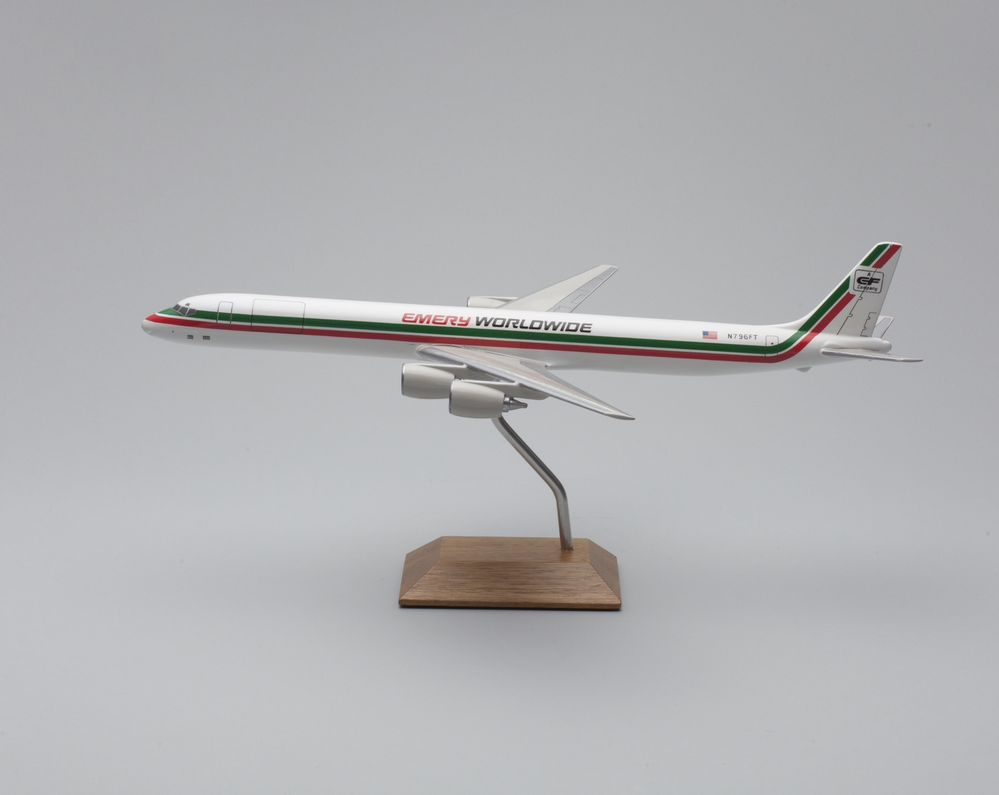

# swift-image-classify-cli

Command line tool for extracting classifications from images using Apple's Vision framework.

## Important

This tool requires Mac OS 10.15 or higher.

## Documentation

Documentation is incomplete.

## Example

All of the images in these examples are included in the [fixtures](fixtures) directory.

```
$> swift build
```

[](https://collection.sfomuseum.org/objects/1880254983/)

```
$> ./.build/debug/image-classify fixtures/plane.jpg | jq
{
  "searchTerms": {
    "aircraft": 0.9907324314117432,
    "stretcher": 0.001220703125,
    "vehicle": 0.9907324314117432,
    "airplane": 0.99072265625,
    "drone_machine": 0.179443359375,
    "machine": 0.9907324314117432
  },
  "categories": {
    "vehicle": 0.9907324314117432,
    "aircraft": 0.9907324314117432,
    "airplane": 0.99072265625,
    "machine": 0.9907324314117432
  }
}
```


## See also

* https://github.com/sfomuseum/swift-image-classify
* https://developer.apple.com/documentation/vision